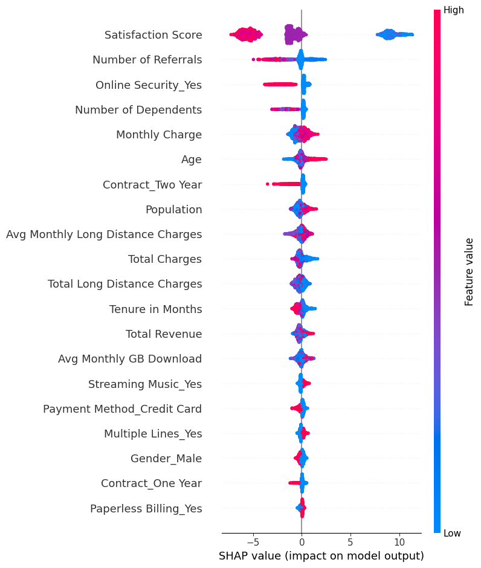
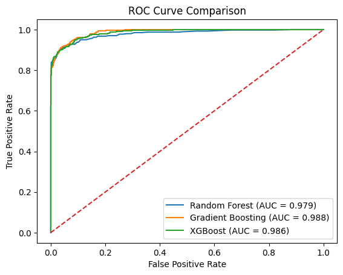

# customer-churn-prediction-ml
ML-based churn prediction using XGBoost, SHAP and cost-sensitive optimization

# Intelligent Customer Churn Prediction Using Ensemble Learning and Explainable AI

## Project Highlights
- Ensemble ML (RF, GB, XGBoost)
- Cost-sensitive optimization (threshold tuning)
- Explainable AI using SHAP
- Business-driven analysis focused churn insights

## Overview
This project develops a machine learning-based system to predict customer churn using ensemble models and explainable AI techniques. The system also incorporates cost-sensitive optimization to align predictions with business objectives.

## Models Used
- Random Forest
- Gradient Boosting
- XGBoost (Final Model)

## Results
- XGBoost achieved highest recall for churn prediction
- Recall improved from **0.88 → 0.90** using threshold tuning
- Gradient Boosting achieved highest ROC-AUC (0.988)

## Cost-Sensitive Optimization
- Threshold reduced from **0.5 → 0.3**
- Improved detection of churn-prone customers
- Trade-off: slight drop in precision, improved recall

## Model Evaluation
- Confusion Matrices for all models
- ROC Curve comparison
- Performance metrics: Precision, Recall, F1-score, ROC-AUC

## Explainable AI (SHAP)
SHAP analysis was used to interpret model predictions.

### Key Insights:
- Low satisfaction → high churn
- High monthly charges → increased churn
- Short tenure → higher churn risk
- Long-term contracts → reduced churn

## Visualizations
### SHAP Plot

### ROC Curve

## 📄 Research Paper
[View Paper](set2026_Helen.pdf)

## Tech Stack
- Python
- Pandas, NumPy
- Scikit-learn
- XGBoost
- SHAP

## How to Run
1. Clone the repo
2. Install requirements:
   pip install -r requirements.txt
3. Run the notebook

## Author
Helen Maria Ajay
